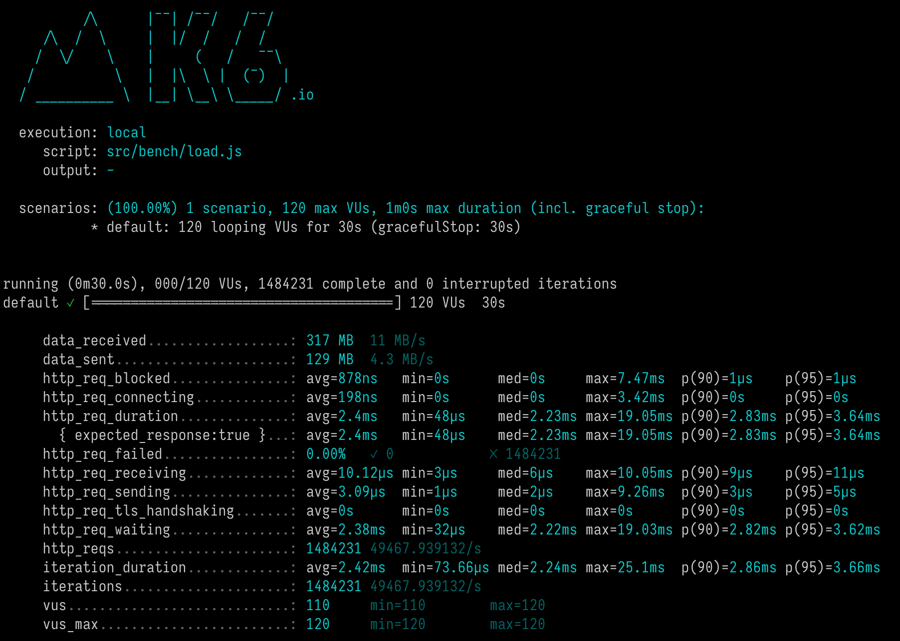
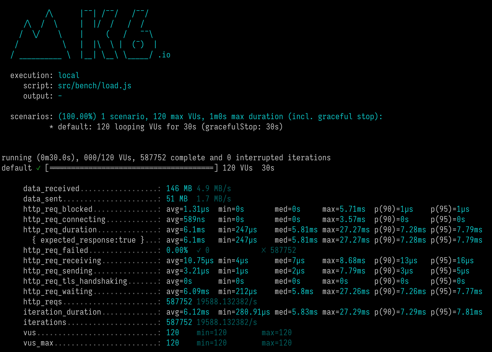
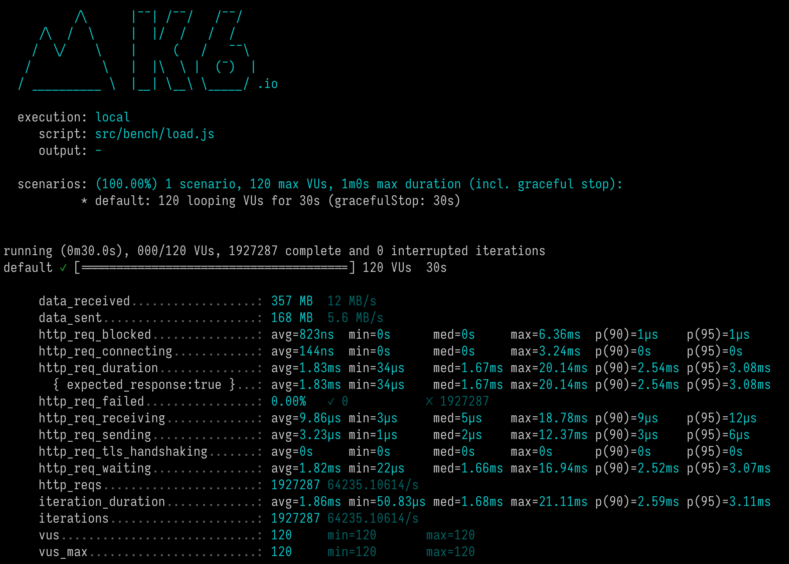

# barehttp

Full-featured slim webserver for microservices with extremely low overhead and ready for production

[](https://snyk.io/test/github/sckv/bare-http)

## Table of Contents

- [Requirements](#Requirements)
- [Quick start](#Quick-start)
- [Usage](#Usage)
- [API](#API)
- [Features](#Features)
- [Support](#Support)

## Requirements

```bash
Node.js >= 14.8
```

## Quick start

Create directory

```bash
mkdir backend-application
cd backend-application
```

Install the service

npm

```bash
npm i barehttp --save
```

yarn

```bash
yarn add barehttp
```

## Usage

### Basic

```typescript
import { BareHttp, logMe } from 'barehttp';

const app = new BareHttp();

app.route.get({
  route: '/route',
  handler: function routeGet(flow) {
    flow.json({ everything: 'OK' });
  })
});


// you can chain the routes
app.route
  .post({
    route: '/route',
    handler: async function routePost(flow) {
      return 'RESPONSE POST';
    },
  })
  .route.patch({
    route: '/route',
    handler: async function routePatch(flow) {
      return 'RESPONSE PATCH';
  })

// Define a middleware
app.use((flow) => {
  logMe.info('my middleware');
});

app.start((address) => {
  console.log(`BareServer started at ${address}`);
});
```

### async-await

```typescript
import { BareHttp, logMe } from 'barehttp';

const app = new BareHttp({ logging: true });

 app.route.get({
  route:'/route',
  handler: async function routeV1() {
    return { promised: 'data' };
  })
});

// Define a middleware
app.use(async (flow) => {
  logMe.info('my middleware');
  await someAuthenticationFlow();
});

app.start((address) => {
  console.log(`BareServer started at ${address}`);
});
```

# API

## `BareHttp(BareOptions)` (Class)

An instance of the application

### `BareOptions` (Object)

Options submitted to the server at initialization

#### `middlewares?` (Array<(flow: BareRequest) => Promise<void> | void>)

If provided, this will apply an array of middlewares to each incoming request.
The order of the array is the order of middlewares to apply

#### `serverPort?` (Number)

Default `3000`

Listening port

#### `serverAddress?` (String)

Default `'0.0.0.0'`

Address to bind the web server to

#### `context?` (Boolean)

Default `false`

Enables request context storage accessible through all application importing `import { context } from 'barehttp';`

#### `logging?` (Boolean)

Default `false`

Enable request/response logging, format varies from `production` or `development` environments, though to change use e.g. `NODE_ENV=production`

#### `ws?` (Boolean)

Default `false`

Enable WebSocket support through `ws` package.

#### `wsOptions?` (Object)

Refer to [ws](https://github.com/websockets/ws) documentation.

#### `errorHandlerMiddleware?` ((err: any, flow: BareRequest) => void)

If provided, will set a custom error handler to catch the bubbled errors from the handlers

#### `requestTimeFormat?` (String: 's' | 'ms')

Default `'s'` - seconds

Request execution time format in `seconds` or `milliseconds`

#### `cookies?` (Boolean)

Control over cookies. If enabled this will turn on automatic cookies decoding, if you want to set up more settings for this (e.g. signed cookies), next option is available

#### `cookiesOptions?` (CookieManagerOptions)

To set options for the cookies decoding/encoding

#### `reverseDns?` (Boolean)

If enabled, and also with `logging: true`, will try to log the resolved reverse DNS of the first hop for remote ip of the client (first proxy).
Logs follow an [Apache Common Log Format](https://httpd.apache.org/docs/2.4/logs.html)

#### `statisticsReport?` (Boolean)

Default `false`

Exposes a basic report with the routes usage under `GET /_report` route

---

## `BareServer.use` ((flow: BareRequest) => Promise<void> | void)

Attach a middleware `after` the middlewares optional array.
The order of the middlewares is followed by code declarations order.

---

## `BareServer.route.get | post | patch | put | delete | options | head | declare` (Function)

To set a route for `get | post | patch | put | delete | options | head` with following parameters:

- `route` (String) - should follow a format of `/your_route`, including params as `/your_route/:param`
- `options` (Object) - `RouteOptions`
- `handler` (Function) - A function with the signature `(flow: BareRequest) => Promise<any> | any`
- `method` (Array) - if the method is `declare` you have to indicate an array of methods to declare the route e.g. `['get', 'post']`
  Example

```ts
app.route.get({
  route: '/route',
  options: { timeout: 2000 },
  handler: async (flow) => {
    return 'My route response';
  },
});

app.route.declare({
  route: '/declared_route',
  handler: () => {
    return 'My declared route response';
  },
  methods: ['post', 'patch'],
});
```

## `BareServer.runtimeRoute.get | post | patch | put | delete | options | head | declare` (Function)

Same as the above routes API, but you can only declare them when the server is `listening`

```ts
app.runtimeRoute
  .get({
    route: '/route',
    options: { timeout: 2000 },
    handler: async (flow) => {
      return 'My route response';
    },
  })
  .declare({
    route: '/declared_runtime_route',
    handler: () => {
      return 'My declared runtime route response';
    },
    methods: ['post', 'patch'],
  });
```

#### `RouteOptions` (Object)

If set, provide per-route options for behavior handling

##### `disableCache?` (Boolean)

Disables all cache headers for the response. This overrides any other cache setting.

##### `cache?` (CacheOptions)

If set, provides a granular cache headers handling per route.

##### `timeout?` (Number)

Request timeout value in `ms`. This will cancel the request _only_ for this route if time expired

---

## `BareServer.ws?` (WebSocketServer)

Based on `ws` package, for internals please refer to [external WebSocketServer](https://github.com/websockets/ws#external-https-server) for documentation.

This particular implementation works out easily for WebSockets interaction for pushing data to server from the clients and waiting for some answer in async.

Also exposes an way to keep pushing messages to the Client from the Server on server handle through internal clients list. (WIP optimizing this)

### `WebSocketServer.declareReceiver` ((Data, UserClient, WSClient, MessageEvent) => Promise\<M> | M)

This is the main 'handler' function for any kind of Client request. If there's a response to that push from the client the return should contain it, otherwise if the response is `void` there will be no answer to the client side.

- `Data`: is the data received from the client for this exact `Type`
- `UserClient`: is an optional client defined on the stage of `Upgrade` to provide some closured client data to be able to know what Client is exactly making the request to the Server
- `WSClient`: raw instance of `ws.Client & { userClient: UC }`
- `MessageEvent`: raw instance of `ws.MessageClient`

Code Example:

```ts
app.ws?.declareReceiver<{ ok: string }>({
  type: 'BASE_TYPE',
  handler: async (data, client) => {
    // do your async or sync operations here
    // return the response if you need to send an answer
    return { cool: 'some answer', client };
  },
});
```

### `WebSocketServer.defineUpgrade` ((IncomingRequest) => Promise\<M> | M)

To de able to handle authorization or any other previous operation before opening and upgrading an incoming client's request.
**If this function is not initialized with the callback, all incoming connections will be accepted by default**

```ts
app.ws?.defineUpgrade(async (req) => {
  // you can do some async or sync operation here
  // the returning of this function will be
  // defined as the `UserClient` and attached to the `ws.Client` instance
  return { access: true, client: {...properties of the client} };
});
```

---

## `BareRequest` (Class)

An instance of the request passed through to middlewares and handlers

### `cm?` (CookiesManager)

Access to the CookiesManager instance attached to the request.

#### `CookiesManager` (Class)

Internal methods to work with cookies

##### `setCookie` (Function)

##### `clearCookie` (Function)

### `getHeader` (Function)

Get an exact header stored to return with this request to the client

### `getCookie` (Function)

Get an exact client cookie of this request

### `getCookies` (Function)

Get all cookies of this request

### `disableCache` (Function)

Imperatively disables cache, does the same as `disableCache: true` in `RouteOptions`

### `setCache` (Function)

Imperatively sets the cache, does the same as `cache: CacheOptions` in `RouteOptions`

### `addHeader` (Function)

Adds a header outgoing header string as a (key, value) `addHeader(header, value)`. Can **not** overwrite.

### `addHeaders` (Function)

Adds outgoing headers in a "batch", merges provided headers object `{ [header: string]: value }` to already existing headers. Can **not** overwrite.

### `setHeader` (Function)

Does the same as `addHeader` but overrides the value.

### `setHeaders` (Function)

Does the same as `addHeaders` but overrides the value.

### `status` (Function)

Set a status for the response

### `sendStatus` (Function)

Set a status for the response and send it (end the request)

### `stream` (Function)

Stream (pipe) a response to the client

### `json` (Function)

Send a JSON response to the client (will attempt to stringify safely a provided object to JSON)

### `send` (Function)

Send a text/buffer response to the client

## Features

Some of the features are in progress.

- [x] Request wide context storage and incorporated tracing (ready for cloud)
- [x] UID (adopted or generated)
- [x] WebSocket server exposure
- [x] handy WebSocket interaction tools, for authorization, etc.
- [x] Request-Processing-Time header and value
- [x] Promised or conventional middlewares
- [x] Logging and serialized with `pino`
- [x] Routes usage report and endpoint
- [x] Cache headers handy handling, per route
- [x] Cookies creation/parsing
- [x] CORS middleware options
- [x] Request execution cancellation by timeout
- [x] Bulk/chaining routes declaration
- [x] Runtime routes hot swapping
- [x] runtime validation schema generation per route response types (on project compile/on launch)
- [ ] middlewares per route
- [ ] swagger OpenAPI 3.0 on `/docs` endpoint
- [ ] swagger OpenAPI 3.0 scheme on `/docs_raw` endpoint
- [ ] optional export of generated schema to a location (yaml, json)
- [ ] streaming/receiving of chunked multipart
- [ ] runtime route params or query validation upon declared types (on project compile/on launch)

## Runtime schema validation on response (EXPERIMENTAL)

This feature enables a runtime check for the returned value for a route,
for now it only works for `return` statements of the routes declared in handlers.

Please write your `return` statements with plain response objects within the `handler` or `controller` function.

To enable this feature you need to set up the following:

- On `BareHttp` settings set: `enableSchemaValidation: true`
- On `BareHttp` settings set: `declaredRoutesPaths: [...array of paths to routes]`,
- On `route.<method>` declaration set: `options: { builtInRuntime: { output: true } }`

## Benchmarks

Done on MacBook Pro with M1 Pro processor. No logs enabled. `NODE_ENV=production` is set. All settings set to default.

### BareHttp



### Express



### Fastify



## Support

Please open an issue if you have any questions or need support

## License

Licensed under [MIT](https://github.com/sckv/bare-http/blob/master/LICENSE).

Konstantin Knyazev
